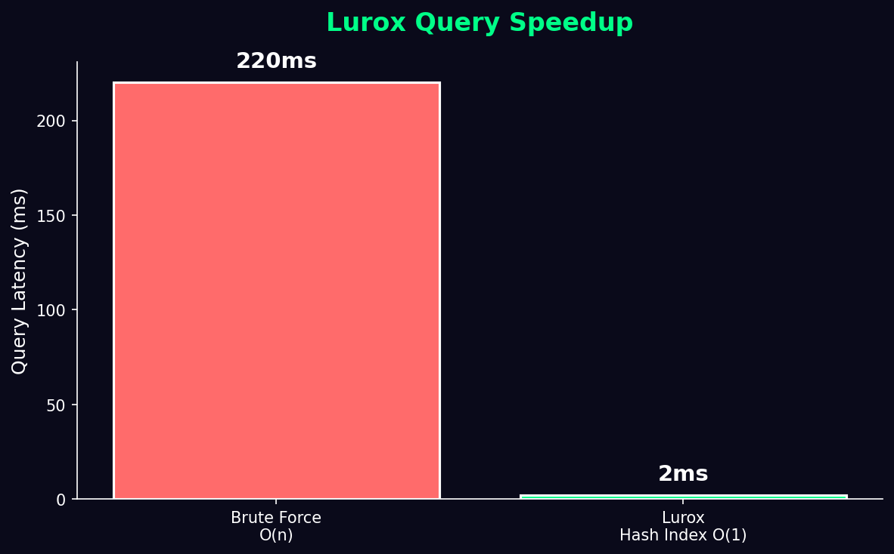

# Lurox
A high-performance search engine built from scratch in C — no libraries, no shortcuts.

**Frontend:** https://lurox.netlify.app · **API:** https://lurox.onrender.com/docs

---

## What is Lurox?
Lurox indexes 10,000 real Stack Overflow questions and returns results in under 15ms. The entire search pipeline — inverted index, hash lookup, ANN traversal, REST API — is written from scratch with zero third-party search libraries.

Built to understand how search engines actually work under the hood, not just use them.

---

## Architecture
User Query → JS Frontend → FastAPI → Python ctypes → C Engine → SQLite → Results

**Core Engine (C)**
- Inverted index using djb2 hashing — O(1) average-case lookup
- Hash table size 4096 (power-of-2 for fast modulo)
- Linked chaining for collision resolution
- Heap-allocated structs — no stack overflow on large datasets
- Posting list per term storing doc_id and frequency

**ANN Engine (C)**
- KD-Tree based Approximate Nearest Neighbor search
- Sub-linear traversal vs brute force O(n) distance calculation

**Python Layer**
- ctypes wrapper bridges Python → C engine directly
- FastAPI exposes `/search`, `/add`, `/health` endpoints
- SQLite persistence — index survives server restarts

---

## Performance



| Method | Latency | Complexity |
|--------|---------|------------|
| Brute Force | ~220ms | O(n) |
| Lurox Hash Index | ~2ms | O(1) avg |

Measured on 10,000 Stack Overflow questions.

---

## Tech Stack

| Layer | Technology |
|-------|------------|
| Core Engine | C (GCC 15.2) — manual memory management |
| Search | Inverted Index + KD-Tree ANN |
| Hashing | djb2 |
| Python Bridge | ctypes |
| Backend | FastAPI + Uvicorn |
| Storage | SQLite3 |
| Frontend | HTML · CSS · Vanilla JS |
| Deployment | Render + Netlify |

---

## Project Structure
Lurox/
├── Core/
│   ├── index.c        # Inverted index + djb2 hash engine
│   └── ann.c          # KD-Tree ANN engine
├── api/
│   ├── main.py        # FastAPI endpoints
│   └── wrapper.py     # Python-C bridge via ctypes
├── data/
│   ├── db.py          # SQLite persistence
│   └── load_data.py   # Dataset indexer
├── frontend/
│   ├── index.html
│   ├── style.css
│   └── script.js
├── render.yaml
└── requirements.txt

---

## Local Setup
```bash
# Compile C engine (Linux/Mac)
gcc -shared -fPIC -o Core/lurox_core.so Core/index.c

# Compile C engine (Windows)
gcc -shared -fPIC -o Core/lurox_core.dll Core/index.c

# Install dependencies
pip install fastapi uvicorn requests

# Load dataset (API must be running)
cd api && uvicorn main:app --reload
python data/load_data.py
```

---

## Roadmap
- [x] Phase 1 — C engine (Inverted Index + KD-Tree ANN)
- [x] Phase 2 — Python ctypes wrapper + SQLite persistence  
- [x] Phase 3 — FastAPI backend
- [x] Phase 4 — JS Frontend
- [x] Phase 5 — Deployed on Render + Netlify