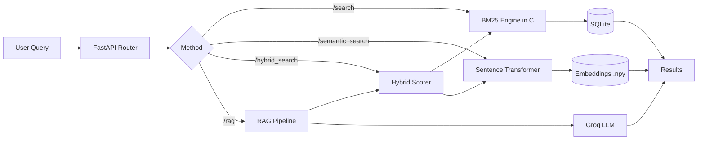
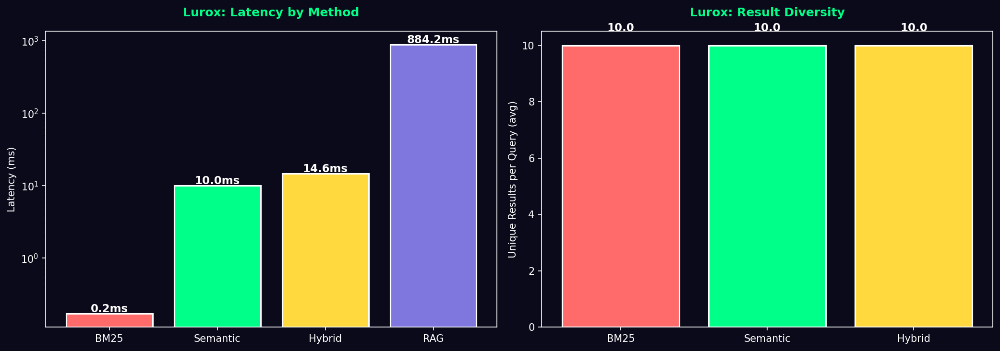
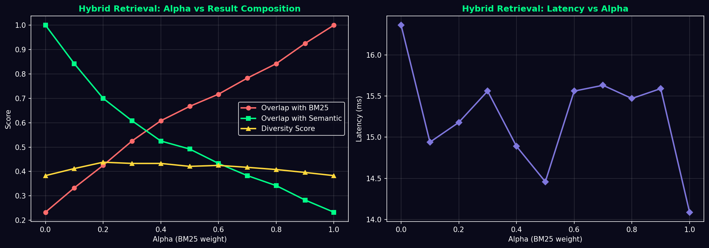

# Lurox

A hybrid retrieval-augmented search engine built from scratch — custom C engine, neural embeddings, and grounded LLM generation.

**Frontend:** https://lurox.netlify.app · **API:** https://lurox.onrender.com/docs

---

## Overview

Lurox indexes 10,000 Stack Overflow questions and supports four retrieval modes — from a custom C-based BM25 inverted index to an end-to-end RAG pipeline. The entire stack is written from scratch with zero third-party search libraries, with neural components added on top.

Built to explore the spectrum between classical information retrieval and modern AI-grounded search.

---

## Architecture



**Layer 1 — Sparse Retrieval (C)**
- Custom inverted index using djb2 hashing — O(1) average-case lookup
- BM25 scoring with IDF weighting, document length normalization, term saturation
- Hash table 8192 with linked chaining for collision resolution
- ~0.2ms per query on 10K documents

**Layer 2 — Dense Retrieval (PyTorch)**
- Sentence Transformer (all-MiniLM-L6-v2, 384-dim embeddings)
- Precomputed embeddings for 10K documents (~14MB on disk)
- Cosine similarity over normalized vectors
- ~10ms per query

**Layer 3 — Hybrid Retrieval**
- Combines normalized BM25 and semantic scores via tunable α weight
- Multi-word query aggregation across both modalities
- Optimal α = 0.2–0.3 identified through 132-query alpha sweep experiment

**Layer 4 — RAG (Groq LLM)**
- Retrieves top-5 documents via hybrid scoring
- Constrains LLM generation to retrieved context only
- Returns answer with cited Stack Overflow sources
- ~880ms end-to-end (including LLM call)

---

## Performance



| Method | Avg Latency | p99 Latency | Output |
|--------|-------------|-------------|--------|
| BM25 | 0.17ms | 0.43ms | Top 10 docs |
| Semantic | 10.01ms | 23.74ms | Top 10 docs |
| Hybrid | 14.63ms | 16.01ms | Top 10 docs |
| RAG | 884.22ms | 1798.51ms | Grounded answer + sources |

Measured on 8 diverse queries × 10K Stack Overflow corpus.

### Alpha Sweep — Hybrid Tuning



Across 12 queries × 11 α values (132 searches), diversity peaks at α = 0.2–0.3, indicating optimal balance between sparse keyword matching and dense semantic similarity.

---

## Tech Stack

| Layer | Technology |
|-------|------------|
| Core Engine | C (GCC 15.2) — manual memory, BM25 from scratch |
| Embedding Model | sentence-transformers (all-MiniLM-L6-v2) |
| LLM | Groq (llama-3.3-70b-versatile) |
| Hashing | djb2 (terms), MurmurHash variant (docs) |
| Python Bridge | ctypes |
| Backend | FastAPI + Uvicorn |
| Storage | SQLite3 + NumPy .npy |
| Frontend | HTML · CSS · Vanilla JS |
| Deployment | Render + Netlify |

---

## API Endpoints

| Endpoint | Method | Description |
|----------|--------|-------------|
| `/search` | POST | BM25 keyword search |
| `/semantic_search` | POST | Dense embedding search |
| `/hybrid_search` | POST | Hybrid sparse + dense |
| `/rag` | POST | RAG with grounded LLM answer |
| `/health` | GET | Service health check |
| `/docs` | GET | Swagger UI |

---

## Project Structure

```
Lurox/
├── api/
│   ├── main.py            # FastAPI endpoints
│   ├── wrapper.py         # Python-C bridge via ctypes
│   ├── semantic.py        # Sentence transformer + cosine
│   ├── hybrid.py          # BM25 + semantic combination
│   └── rag.py             # Groq LLM grounded generation
├── Core/
│   ├── index.c            # BM25 inverted index in C
│   └── ann.c              # KD-Tree ANN engine
├── data/
│   ├── db.py              # SQLite persistence
│   ├── load_data.py       # Dataset indexer
│   ├── embeddings.npy     # Precomputed (gitignored)
│   └── doc_ids.npy        # Doc ID mapping (gitignored)
├── scripts/
│   ├── build_embeddings.py    # One-time embedding generation
│   ├── alpha_sweep.py         # 132-query hybrid experiment
│   ├── full_evaluation.py     # End-to-end benchmark
│   └── test_load.py
├── benchmarks/
│   ├── alpha_sweep.png
│   ├── full_evaluation.png
│   └── *.json
├── frontend/
│   ├── index.html
│   ├── style.css
│   └── script.js
└── render.yaml
```

---

## Local Setup

```bash
# 1. Compile C engine
gcc -shared -fPIC -o Core/lurox_core.dll Core/index.c    # Windows
gcc -shared -fPIC -o Core/lurox_core.so  Core/index.c    # Linux/Mac

# 2. Install dependencies
pip install fastapi uvicorn sentence-transformers groq python-dotenv numpy matplotlib

# 3. Set environment
echo "GROQ_API_KEY=your_key_here" > .env

# 4. Build embeddings (one-time, ~6 seconds on modern hardware)
py -3.13 scripts/build_embeddings.py

# 5. Run server
cd api
uvicorn main:app --reload

# 6. (Optional) Run benchmarks
py -3.13 scripts/alpha_sweep.py
py -3.13 scripts/full_evaluation.py
```

---

## Build History

- [x] Phase 1 — Custom C engine (inverted index, KD-Tree ANN)
- [x] Phase 2 — Python ctypes bridge, FastAPI, SQLite persistence
- [x] Phase 3 — Frontend, Render + Netlify deployment
- [x] Phase 4 — BM25 scoring (IDF, length normalization, term saturation)
- [x] Phase 5 — Dense semantic retrieval (sentence-transformers)
- [x] Phase 6 — Hybrid retrieval with alpha sweep analysis
- [x] Phase 7 — RAG pipeline with grounded LLM generation
- [x] Phase 8 — Full evaluation benchmarks (BM25 vs Semantic vs Hybrid vs RAG)